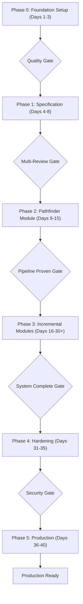

# The Unified Development Excellence Framework (UDEF)

## A Comprehensive Build Methodology for Predictable, High-Quality Software Delivery

Based on analysis of successful methodologies (MIAIR-v3.3.3, Enhanced 5-Pass Method) and critical lessons from failed projects (DevDocAI, RIS, documentation crises), this framework synthesizes proven practices into a unified approach for all future builds.

---

## Core Philosophy

**"Foundation First, Simplicity Always, Quality Non-Negotiable"**

### Fundamental Principles

1. **Start Simple, Earn Complexity** - Begin with minimal viable architecture
2. **Never Hide Problems** - Fail fast and loud, fix root causes
3. **CI Must Mirror Production** - Use same base runtime; test image adds dev tools
4. **Documentation Is Infrastructure** - Invest early, maintain constantly
5. **Complete Each Phase** - No half-finished migrations or changes
6. **Test Before Code** - TDD is not optional

---

## Framework Structure Overview

This framework operates at two levels:

- **Project Phases** (0-5): Overall project lifecycle stages
- **Module Passes** (0-5): Individual module development steps



---

## Phase 0: Foundation Setup (Days 1-3)

### Objective

Establish unshakeable foundation before writing any production code.

### Day 1: Container-First Environment

Create multi-stage Dockerfile for both runtime and testing:

```dockerfile
# Multi-stage Dockerfile
FROM python:3.11-slim AS base

# Set environment variables for Python optimization
ENV PYTHONDONTWRITEBYTECODE=1 \
    PYTHONUNBUFFERED=1

WORKDIR /app

# Install system dependencies
RUN apt-get update && apt-get install -y --no-install-recommends \
    gcc \
    && rm -rf /var/lib/apt/lists/*

# Copy dependency files
COPY pyproject.toml README.md ./
COPY src ./src

# Install production dependencies
RUN pip install --no-cache-dir -e .

# Test stage - includes dev dependencies and test files
FROM base AS test
RUN pip install --no-cache-dir -e .[dev]
COPY tests ./tests
COPY .coveragerc ./
CMD ["pytest", "-v"]

# Production runtime stage
FROM base AS runtime

# Create non-root user for security
RUN useradd -m -u 1000 appuser && chown -R appuser:appuser /app
USER appuser

# Run with uvicorn
CMD ["uvicorn", "project_name.main:app", "--host", "0.0.0.0", "--port", "8000"]
```

### Day 2: Project Structure & Configuration

Repository structure:

```
project-name/
├── .github/
│   └── workflows/
│       └── ci.yml          # CI/CD pipeline
├── src/
│   └── project_name/       # SRC layout mandatory
│       ├── __init__.py
│       ├── main.py         # FastAPI app entry
│       ├── config.py       # Settings management
│       ├── api/
│       │   └── health.py
│       └── middleware/
│           ├── security.py
│           └── monitoring.py
├── tests/
│   ├── conftest.py        # Shared fixtures
│   ├── unit/
│   ├── integration/
│   └── performance/
├── docs/
│   ├── design/            # Specifications
│   ├── reports/           # Implementation reports
│   └── adr/              # Architecture Decision Records
├── Dockerfile
├── docker-compose.yml
├── pyproject.toml
├── requirements.lock      # Pinned dependencies (generated)
├── .coveragerc
├── README.md
└── .gitignore
```

Single dependency configuration:

```toml
# pyproject.toml
[build-system]
requires = ["setuptools>=61", "wheel"]
build-backend = "setuptools.build_meta"

[project]
name = "project-name"
version = "0.1.0"
dependencies = [
    "fastapi>=0.100.0",
    "pydantic>=2.0.0",
    "pydantic-settings>=2.2.1",
    "uvicorn>=0.23.0",
    "structlog>=24.0.0"
]

[project.optional-dependencies]
dev = [
    "pytest>=7.0.0",
    "pytest-cov>=4.0.0",
    "pytest-asyncio>=0.23.0",  # For async test support
    "ruff>=0.1.0",
    "mypy>=1.0.0",
    "httpx>=0.25.0",  # For async tests (AsyncClient)
    "radon>=6.0.0",   # Complexity checking
    "xenon>=0.9.0"    # Complexity enforcement
]
ml = [
    "numpy>=1.24.0",
    "scipy>=1.10.0"
]
# Note: 'all' extras cannot self-reference; use lockfile for pinning
```

Dependency pinning strategy:

```bash
# Generate lockfile for reproducible builds
pip install pip-tools
pip-compile pyproject.toml -o requirements.lock
# Or with uv:
uv pip compile pyproject.toml -o requirements.lock

# In Docker, install from lockfile:
# RUN pip install --no-cache-dir -r requirements.lock
```

Test configuration fixtures:

```python
# tests/conftest.py
import pytest
from fastapi.testclient import TestClient
from project_name.main import app

@pytest.fixture
def client():
    """Test client for FastAPI application."""
    return TestClient(app)

@pytest.fixture
def auth_headers():
    """Mock authentication headers for protected endpoints."""
    return {"Authorization": "Bearer test-token"}
```

### Day 3: Quality Enforcement Setup

Pre-commit configuration:

```yaml
# .pre-commit-config.yaml
repos:
  - repo: local
    hooks:
      - id: no-placeholders
        name: Block TODOs and incomplete code
        entry: "TODO|FIXME|XXX|NotImplementedError"
        language: pygrep
        types: [python]
        # Applies to Python files only

  - repo: https://github.com/astral-sh/ruff-pre-commit
    rev: v0.6.9
    hooks:
      - id: ruff
        args: ["--fix"]

  - repo: https://github.com/pre-commit/mirrors-mypy
    rev: v1.11.2
    hooks:
      - id: mypy
        additional_dependencies: ["pydantic>=2.0.0", "fastapi>=0.100.0"]
        args: ["--strict"]
```

Initial CI pipeline:

```yaml
# .github/workflows/ci.yml
name: CI/CD Pipeline
on: [push, pull_request]

jobs:
  test:
    runs-on: ubuntu-latest
    steps:
      - uses: actions/checkout@v4

      - name: Build Docker images
        run: |
          docker build -t project:runtime --target runtime .
          docker build -t project:test --target test .

      - name: Lint with ruff
        run: |
          docker run --rm -v ${{ github.workspace }}:/app project:test \
            ruff check src tests

      - name: Type check with mypy
        run: |
          docker run --rm -v ${{ github.workspace }}:/app project:test \
            mypy src

      - name: Run unit tests with coverage
        run: |
          docker run --rm -v ${{ github.workspace }}:/app project:test \
            pytest tests/unit -v --cov=src --cov-branch \
            --cov-report=term --cov-fail-under=80
```

### Phase 0 Validation Checklist

- [ ] Multi-stage Docker builds successfully (runtime and test)
- [ ] Container runs without errors
- [ ] Pre-commit hooks installed and working
- [ ] SRC layout structure in place
- [ ] Single dependency system (pyproject.toml only)
- [ ] Lockfile generation strategy documented
- [ ] Test fixtures configured
- [ ] Documentation directories created
- [ ] .gitignore includes all cache patterns

### Human Gate: Foundation Review

**Do NOT proceed until all items validated**

---

## Phase 1: Specification & Design (Days 4-8)

### Objective

Create comprehensive specifications using three-document framework before any implementation.

### Days 4-5: Requirements Documentation

Create requirements specification:

```markdown
# docs/design/MODULE_NAME-requirements.md

## Functional Requirements

FR-01: System SHALL provide health check endpoint at /health
FR-02: Health check SHALL include service version string
FR-03: Health check SHALL include ISO 8601 timestamp with timezone
FR-04: Health check SHALL respond with JSON content-type
FR-05: System SHALL validate all incoming requests with proper HTTP status codes
FR-06: Service SHALL provide structured JSON error responses for all error conditions
FR-07: System SHALL support graceful shutdown on SIGTERM signal
FR-08: Service SHALL implement request ID tracing for correlation across logs
FR-09: System SHALL provide OpenAPI/Swagger documentation at /docs endpoint
FR-10: Service SHALL return appropriate HTTP caching headers for static responses

## Non-Functional Requirements

NFR-01: Service SHALL handle 1000 req/sec under normal load
NFR-02: Code coverage SHALL exceed 80% for initial modules
NFR-03: API response time P95 SHALL be < 200ms
NFR-04: Service SHALL implement rate limiting (60 req/min per IP)
NFR-05: System SHALL maintain <0.1% error rate under normal operating conditions
NFR-06: Service SHALL support horizontal scaling with stateless architecture

## Verification Criteria

- Each requirement has automated test
- Performance measured with benchmark suite
- Coverage enforced in CI pipeline
```

### Days 6-7: Design Documentation

Create design specification:

```markdown
# docs/design/MODULE_NAME-design.md

## Architecture Pattern

- Hexagonal architecture for core logic isolation
- Repository pattern for data access
- Dependency injection for testability

## API Contracts

### GET /health

Response 200 OK:
{
"status": "healthy",
"version": "0.1.0",
"timestamp": "2024-01-01T00:00:00Z"
}

Headers:

- Content-Type: application/json
- X-Response-Time: <milliseconds>

## Integration Points

- Current: Standalone service, no external dependencies
- Planned: PostgreSQL for persistence (v0.2.0)
- Planned: Redis for distributed rate limiting (v0.3.0)

## Performance Strategy

- In-memory caching for static responses
- Connection pooling for future database
- Structured logging with async handlers
```

### Day 8: Task Breakdown

Create implementation tasks:

```markdown
# docs/design/MODULE_NAME-tasks.md

## Implementation Tasks

### TASK-001: Setup health check endpoint (2 hours)

- Create FastAPI application structure
- Implement health router with version injection
- Add ISO 8601 timestamp with timezone
- Write comprehensive unit tests
- Verification: curl http://localhost:8000/health returns valid JSON

### TASK-002: Add performance monitoring (2 hours)

- Implement timing middleware
- Add structured logging with structlog
- Create performance benchmark suite
- Verification: Logs show request duration in milliseconds

### TASK-003: Implement rate limiting (3 hours)

- Create rate limiter middleware
- Add IP-based tracking (dev version)
- Document Redis migration path
- Verification: 429 response after limit exceeded
```

### Phase 1 Validation Checklist

- [ ] Requirements specification complete with measurable criteria
- [ ] Design specification with concrete API examples
- [ ] Task breakdown with time estimates
- [ ] Test scenarios mapped to requirements
- [ ] Performance targets quantified

### Human Gate: Specification Approval

**No implementation code until specifications approved**

---

## Phase 2: Pathfinder Module Implementation (Days 9-15)

### Objective

First module establishes patterns and builds CI/CD pipeline for all future modules.

### Module Selection Criteria

Choose a module that:

- Touches multiple architectural layers
- Is simple enough to complete in one week
- Provides real business value
- Can establish testing patterns

Good choices: Health/Status API, Basic Authentication, Configuration Management
Poor choices: Complex algorithms, Pure UI components, External integrations

### The 5-Pass Module Development Method

#### Pass 0: Design Validation (Day 9, Morning)

Validate design assumptions:

```python
# tests/validation/test_framework_setup.py
"""Validate framework compatibility and setup."""

def test_fastapi_setup():
    """Verify FastAPI and Pydantic work as expected."""
    from fastapi import FastAPI
    from pydantic import BaseModel

    app = FastAPI()

    class HealthResponse(BaseModel):
        status: str
        version: str
        timestamp: str

    # Verify framework initialization
    assert app is not None
    assert app.title == "FastAPI"

    # Verify model validation
    response = HealthResponse(
        status="healthy",
        version="0.1.0",
        timestamp="2024-01-01T00:00:00Z"
    )
    assert response.status == "healthy"

def test_structlog_setup():
    """Verify structlog is properly configured."""
    import structlog
    logger = structlog.get_logger()
    assert logger is not None
```

#### Pass 1: TDD Implementation (Days 9-10)

First, create the main application with middleware:

```python
# src/project_name/main.py
from fastapi import FastAPI
from project_name.api import health
from project_name.middleware.security import rate_limit_middleware
from project_name.middleware.monitoring import logging_middleware

app = FastAPI(
    title="Project Name",
    version="0.1.0",
    description="Production-ready service following UDEF"
)

# Wire up middleware
app.middleware("http")(logging_middleware)
app.middleware("http")(rate_limit_middleware)

# Include routers
app.include_router(health.router, tags=["health"])
```

Write tests first:

```python
# tests/unit/test_health.py
import re
from datetime import datetime

def test_health_endpoint_status(client):
    """Test health check returns correct status code."""
    response = client.get("/health")
    assert response.status_code == 200

def test_health_endpoint_content(client):
    """Test health check returns required fields."""
    response = client.get("/health")
    data = response.json()

    assert data["status"] == "healthy"
    assert data["version"] == "0.1.0"
    assert "timestamp" in data

    # Verify timestamp format (ISO 8601 with Z suffix)
    timestamp_pattern = r'^\d{4}-\d{2}-\d{2}T\d{2}:\d{2}:\d{2}(\.\d+)?Z$'
    assert re.match(timestamp_pattern, data["timestamp"])

def test_health_endpoint_performance(client):
    """Test health check responds quickly."""
    import time

    start = time.perf_counter()
    response = client.get("/health")
    duration = time.perf_counter() - start

    assert response.status_code == 200
    assert duration < 0.1  # 100ms max for single request
```

Then implement to pass tests:

```python
# src/project_name/api/health.py
from fastapi import APIRouter
from datetime import datetime, timezone
from pydantic import BaseModel

router = APIRouter()

class HealthResponse(BaseModel):
    """Health check response model."""
    status: str
    version: str
    timestamp: str

@router.get("/health", response_model=HealthResponse)
async def health_check() -> HealthResponse:
    """
    Health check endpoint.

    Returns service status, version, and current timestamp.
    """
    return HealthResponse(
        status="healthy",
        version="0.1.0",
        timestamp=datetime.now(timezone.utc).isoformat().replace("+00:00", "Z")
    )
```

#### Pass 2: Performance Baseline (Day 11, Morning)

Establish performance benchmarks:

```python
# tests/performance/test_benchmarks.py
import time
import json
import statistics
from pathlib import Path

def test_health_endpoint_performance(client):
    """Establish performance baseline for health endpoint."""
    # Warmup
    for _ in range(10):
        client.get("/health")

    # Measure
    iterations = 100
    timings = []

    for _ in range(iterations):
        start = time.perf_counter()
        response = client.get("/health")
        elapsed = time.perf_counter() - start

        assert response.status_code == 200
        timings.append(elapsed * 1000)  # Convert to ms

    # Calculate statistics
    p50 = statistics.median(timings)
    p95 = statistics.quantiles(timings, n=20)[18]  # 95th percentile
    p99 = statistics.quantiles(timings, n=100)[98]  # 99th percentile

    # Save baseline
    baseline_file = Path("benchmarks.json")
    baselines = {}
    if baseline_file.exists():
        baselines = json.loads(baseline_file.read_text())

    baselines["health_endpoint"] = {
        "p50_ms": round(p50, 2),
        "p95_ms": round(p95, 2),
        "p99_ms": round(p99, 2),
        "iterations": iterations
    }
    baseline_file.write_text(json.dumps(baselines, indent=2))

    # Assert reasonable performance (relaxed for CI environments)
    assert p95 < 50, f"P95 latency {p95}ms exceeds 50ms threshold"
    print(f"Performance: P50={p50:.2f}ms, P95={p95:.2f}ms, P99={p99:.2f}ms")
```

#### Pass 3: Security Hardening (Day 11, Afternoon)

Add security layers:

```python
# src/project_name/middleware/security.py
from fastapi import Request, HTTPException
from collections import defaultdict
from datetime import datetime, timedelta
import structlog
from typing import Dict, List

logger = structlog.get_logger()

class RateLimiter:
    """
    Basic in-memory rate limiter for single-instance deployments.

    WARNING: This implementation stores state in memory and is suitable
    only for development or single-instance deployments. Production
    systems with multiple replicas MUST use a centralized state store
    (e.g., Redis) to share rate-limiting data across all instances.

    Example Redis implementation path:
    - Use redis.incr() with key expiration for distributed counting
    - Key format: f"rate_limit:{client_ip}:{current_minute}"
    """

    def __init__(self, requests_per_minute: int = 60):
        self.requests_per_minute = requests_per_minute
        self.requests: Dict[str, List[datetime]] = defaultdict(list)

    async def check_rate_limit(self, request: Request) -> None:
        """Check if request exceeds rate limit."""
        client_ip = request.client.host if request.client else "unknown"
        now = datetime.utcnow()
        minute_ago = now - timedelta(minutes=1)

        # Clean old requests
        self.requests[client_ip] = [
            req_time for req_time in self.requests[client_ip]
            if req_time > minute_ago
        ]

        # Check limit
        request_count = len(self.requests[client_ip])
        if request_count >= self.requests_per_minute:
            logger.warning(
                "rate_limit_exceeded",
                client_ip=client_ip,
                request_count=request_count,
                limit=self.requests_per_minute
            )
            raise HTTPException(
                status_code=429,
                detail=f"Rate limit exceeded. Max {self.requests_per_minute} requests per minute."
            )

        # Record request
        self.requests[client_ip].append(now)
        logger.debug(
            "rate_limit_check",
            client_ip=client_ip,
            requests_in_window=request_count + 1
        )

# Middleware integration
rate_limiter = RateLimiter()

async def rate_limit_middleware(request: Request, call_next):
    """Apply rate limiting to all requests."""
    await rate_limiter.check_rate_limit(request)
    response = await call_next(request)
    return response
```

#### Pass 4: Refactoring (Day 12)

Focus on code quality improvements:

```python
# src/project_name/config.py
from pydantic_settings import BaseSettings

class Settings(BaseSettings):
    """Application settings from environment variables."""

    app_name: str = "project-name"
    version: str = "0.1.0"
    rate_limit_per_minute: int = 60
    log_level: str = "INFO"
    log_salt: str = "change-me-in-production"  # For PII hashing

    class Config:
        env_prefix = "APP_"

settings = Settings()
```

Updated monitoring with stable hashing:

```python
# src/project_name/middleware/monitoring.py
import time
import hashlib
import structlog
from fastapi import Request
from project_name.config import settings

logger = structlog.get_logger()

def stable_hash(value: str) -> str:
    """Create stable hash for PII data."""
    return hashlib.sha256(
        (settings.log_salt + value).encode()
    ).hexdigest()[:16]

async def logging_middleware(request: Request, call_next):
    """Log all requests with timing and metadata."""
    start_time = time.perf_counter()

    # Generate request ID for tracing
    request_id = request.headers.get("X-Request-ID", str(time.time()))

    # Log request (without PII)
    logger.info(
        "request_started",
        request_id=request_id,
        method=request.method,
        path=request.url.path,
        # Use stable hash for correlation across runs
        client_hash=stable_hash(request.client.host) if request.client else None
    )

    # Process request
    response = await call_next(request)

    # Calculate duration
    duration_ms = (time.perf_counter() - start_time) * 1000

    # Log response
    logger.info(
        "request_completed",
        request_id=request_id,
        status_code=response.status_code,
        duration_ms=round(duration_ms, 2)
    )

    # Add timing header
    response.headers["X-Response-Time"] = f"{duration_ms:.2f}ms"

    return response
```

#### Pass 5: User Validation (Day 13)

Deploy to staging and validate:

```bash
#!/bin/bash
# scripts/validate_staging.sh

echo "Building and deploying to staging..."
docker build -t project:staging --target runtime .
docker run -d --name project-staging -p 8000:8000 project:staging

echo "Waiting for service to start..."
sleep 3

echo "Running smoke tests..."
curl -f http://localhost:8000/health || exit 1

echo "Checking rate limiting..."
for i in {1..61}; do
    response=$(curl -s -o /dev/null -w "%{http_code}" http://localhost:8000/health)
    if [ $i -eq 61 ] && [ "$response" != "429" ]; then
        echo "Rate limiting not working!"
        exit 1
    fi
done

echo "All validation checks passed!"
docker stop project-staging
docker rm project-staging
```

### Days 14-15: Pipeline Completion

Finalize comprehensive CI/CD:

```yaml
# .github/workflows/ci.yml
name: CI/CD Pipeline
on: [push, pull_request]

env:
  DOCKER_BUILDKIT: 1

jobs:
  test:
    runs-on: ubuntu-latest
    steps:
      - uses: actions/checkout@v4

      - name: Build Docker images
        run: |
          docker build -t project:runtime --target runtime .
          docker build -t project:test --target test .

      - name: Lint with ruff
        run: |
          docker run --rm -v ${{ github.workspace }}:/app project:test \
            ruff check src tests

      - name: Type check with mypy
        run: |
          docker run --rm -v ${{ github.workspace }}:/app project:test \
            mypy src --strict

      - name: Run unit tests with coverage
        run: |
          docker run --rm -v ${{ github.workspace }}:/app project:test \
            pytest tests/unit -v --cov=src --cov-branch \
            --cov-report=term-missing --cov-fail-under=80

      - name: Run integration tests
        if: success()
        run: |
          docker run --rm -v ${{ github.workspace }}:/app project:test \
            pytest tests/integration -v

      - name: Performance benchmarks
        if: success()
        run: |
          docker run --rm -v ${{ github.workspace }}:/app project:test \
            pytest tests/performance -v

      - name: Check complexity
        run: |
          docker run --rm -v ${{ github.workspace }}:/app project:test \
            bash -c "radon cc src -s --total-average && xenon src --max-absolute B --max-modules B --max-average B"

      - name: Security scan
        uses: aquasecurity/trivy-action@0.24.0
        with:
          image-ref: "project:runtime"
          severity: "HIGH,CRITICAL"
          exit-code: "1"

      - name: Deploy to staging
        if: github.ref == 'refs/heads/main' && github.event_name == 'push'
        run: |
          echo "Deploying to staging environment..."
          # Deploy commands for your platform:
          # - Push to container registry
          # - Update kubernetes deployment
          # - Or deploy to cloud platform
```

### Phase 2 Validation Checklist

- [ ] Pathfinder module fully implemented with TDD
- [ ] 80% test coverage achieved (both line and branch)
- [ ] Performance baselines established and documented
- [ ] Security measures in place (rate limiting, logging)
- [ ] CI/CD pipeline fully operational
- [ ] Both runtime and test images building correctly
- [ ] Staging deployment validated
- [ ] Complexity metrics passing

### Human Gate: Pipeline Proven

**Pipeline must work completely before proceeding**

---

## Phase 3: Incremental Module Development (Days 16-30+)

### Objective

Deliver remaining modules using established patterns and pipeline.

### Module Development Cycle

Each module follows 3-5 day rhythm:

**Day 1**: Specification review & Pass 0 validation
**Day 2-3**: Pass 1 TDD implementation (now targeting 95% coverage)
**Day 4**: Passes 2-4 (performance, security, refactoring)
**Day 5**: Pass 5 validation & deployment

### Coverage Progression

By Phase 3, increase coverage requirements:

```yaml
# Update CI coverage requirement
--cov-fail-under=95  # Increased from 80%
--cov-branch        # Include branch coverage
```

### Module Development Rules

#### Strictly Enforce

- Test-first development (TDD) - no exceptions
- Zero placeholders in committed code
- Mandatory refactoring pass
- 95% coverage minimum (line and branch)
- Documentation updates with each PR

#### Emergency Fixes

Production systems sometimes require emergency fixes despite best intentions:

1. **Hotfix Process** (when critical issues arise):

   ```bash
   # Create hotfix branch from production
   git checkout -b hotfix/critical-issue production

   # Apply minimal fix with test
   # Deploy through expedited pipeline
   # Immediately create follow-up ticket
   ```

2. **Post-Hotfix Requirements**:
   - Root cause analysis within 24 hours
   - Comprehensive fix in next sprint
   - Add regression tests
   - Update runbook with incident details
   - Architecture Decision Record if pattern emerged

### Human Gate: Module Completion

For each module verify:

- [ ] 95% test coverage (line and branch)
- [ ] Performance within defined SLAs
- [ ] Security scan clean
- [ ] Documentation current
- [ ] Deployed to staging
- [ ] Complexity metrics passing (<10)

---

## Phase 4: System Hardening (Days 31-35)

### Objective

System-wide optimization and production readiness verification.

### Day 31-32: Integration Testing

Complete system testing:

```python
# tests/integration/test_system_flow.py
import pytest

@pytest.mark.integration
def test_complete_user_flow_sync(client):
    """Test full user journey through system (synchronous version)."""
    # Test health endpoint
    response = client.get("/health")
    assert response.status_code == 200
    assert response.json()["status"] == "healthy"

    # Test rate limiting
    for _ in range(60):
        client.get("/health")

    # 61st request should be rate limited
    response = client.get("/health")
    assert response.status_code == 429

    # For async tests, use pytest-asyncio:
    # @pytest.mark.asyncio
    # async def test_async_flow(async_client):
    #     """Test full user journey using async client."""
    #     response = await async_client.get("/health")
    #     assert response.status_code == 200
    #     assert response.json()["status"] == "healthy"
```

### Day 33: Performance Optimization

Profile and optimize only proven bottlenecks:

```python
# scripts/profile_system.py
import cProfile
import pstats
from io import StringIO

def profile_endpoint():
    """Profile system under load."""
    profiler = cProfile.Profile()

    profiler.enable()
    # Run load test
    import requests
    import threading
    import time
    
    def load_test_worker():
        """Single worker for load testing."""
        for _ in range(100):
            try:
                requests.get("http://localhost:8000/health", timeout=1.0)
            except requests.exceptions.RequestException:
                pass  # Expected under load
    
    # Simulate concurrent load
    threads = []
    for _ in range(10):  # 10 concurrent workers
        thread = threading.Thread(target=load_test_worker)
        threads.append(thread)
        thread.start()
    
    # Wait for completion
    for thread in threads:
        thread.join()
        
    profiler.disable()

    # Analyze results
    stream = StringIO()
    stats = pstats.Stats(profiler, stream=stream)
    stats.sort_stats('cumulative')
    stats.print_stats(20)  # Top 20 functions

    print(stream.getvalue())

    # Save for analysis
    profiler.dump_stats('profile_results.prof')
```

### Day 34: Security Audit

Comprehensive security validation:

- Dependency scanning with Trivy/Snyk
- OWASP Top 10 checklist
- Rate limiting verification under load
- Input validation fuzzing
- Secrets scanning in codebase

### Day 35: Documentation Finalization

Complete production documentation:

- API documentation (OpenAPI/Swagger)
- Deployment runbook
- Monitoring and alerts setup
- Incident response procedures
- Architecture Decision Records

### Phase 4 Validation Checklist

- [ ] All integration tests passing
- [ ] Performance profiled and optimized
- [ ] Security audit complete with no high/critical issues
- [ ] Documentation comprehensive and current
- [ ] Disaster recovery plan tested
- [ ] Monitoring dashboards configured

### Human Gate: Production Readiness

**All items must be validated before production**

---

## Phase 5: Production Deployment (Days 36-40)

### Objective

Safe, monitored production deployment with rollback capability.

### Deployment Strategy

**Day 36-37**: Final staging validation
**Day 38**: Canary deployment (5% traffic)
**Day 39**: Progressive rollout (25%, 50%, 75%)
**Day 40**: Full production (100%)

### Success Metrics

Production validation criteria:

- Error rate < 0.1% over 24 hours
- P95 latency within defined SLAs
- Zero critical bugs in first 48 hours
- Successful rollback drill performed
- All alerts firing correctly

---

## Anti-Pattern Prevention Guide

### From Project Failures

#### RIS Lessons

- ✅ Use same base runtime image for dev, CI, and production
- ✅ Test image adds dev tools on top of runtime base
- ✅ All dependencies explicitly declared with lockfile for pinning
- ❌ Never use `pip install --no-deps`
- ❌ Never diverge the base runtime image between CI and production

#### DevDocAI Lessons

- ✅ Complete architectural changes fully
- ✅ Single source of truth for configuration
- ✅ Use SRC layout from project start
- ❌ Never mix flat and src layouts
- ❌ Never leave migrations half-complete

#### Documentation Crisis Lessons

- ✅ Separate design specs from implementation reports
- ✅ Schedule weekly documentation reviews
- ✅ Use Architecture Decision Records for planned features
- ❌ Never mix document types
- ❌ Never let docs drift from implementation

### From Project Successes

#### MIAIR Success Patterns

- ✅ Enforce anti-shortcut philosophy consistently
- ✅ Three-document specification before code
- ✅ Multi-stage review gates
- ✅ Maintain high coverage standards

#### 5-Pass Method Patterns

- ✅ Always validate design before building
- ✅ Let Module 1 build the entire pipeline
- ✅ Mandatory refactoring pass
- ✅ Real user validation before production

---

## Decision Frameworks

### When to Reset vs Repair

**Reset the project when**:

- Foundation issues affect > 50% of codebase
- Multiple (3+) emergency fixes in one week
- Core architectural assumptions proven wrong
- Technical debt exceeds feature velocity
- Team has lost confidence in codebase

**Repair incrementally when**:

- Issues isolated to specific modules
- Clear fix path identified and documented
- Working features provide value to users
- Foundation remains architecturally sound
- Team understands and agrees with approach

### Complexity Management

Add complexity only when:

1. Current solution proven inadequate through measurement
2. Simpler alternatives exhausted and documented
3. Benefits quantified and exceed costs significantly
4. Team prepared to maintain added complexity
5. Architecture Decision Record created

### Architecture Decision Records (ADRs)

Document all significant decisions:

```markdown
# docs/adr/001-rate-limiting-approach.md

## Status: Accepted

## Date: 2025-01-15

## Context

Need rate limiting for API protection. Must choose between
in-memory (simple) and Redis (distributed).

## Decision

Use in-memory for v0.1, migrate to Redis for v0.2 when
horizontal scaling required.

## Consequences

- Positive: Faster initial development
- Negative: Must coordinate migration before scaling
- Mitigation: Clear interface makes swap straightforward
```

---

## Success Metrics

### Module Level

- **Delivery**: 3-5 days per module after pipeline established
- **Coverage**: 80% initially, 95% by Phase 3 (line + branch)
- **Complexity**: Cyclomatic complexity < 10 (enforced with xenon)
- **Performance**: Meeting all defined SLA targets
- **Documentation**: Updated with every PR

### Project Level

- **Phase 0-1**: Foundation complete in 8 days
- **Phase 2**: Pipeline proven with pathfinder in 7 days
- **Phase 3+**: 3-5 days per additional module
- **Total**: ~40 days for typical 5-module system
- **Quality**: Zero high/critical security issues

---

## Implementation Timeline Summary

**Week 1 (Days 1-7)**:

- Days 1-3: Foundation setup with containers
- Days 4-7: Begin specifications

**Week 2 (Days 8-14)**:

- Day 8: Complete specifications
- Days 9-13: Implement pathfinder module with TDD
- Day 14: Begin pipeline finalization

**Week 3 (Days 15-21)**:

- Day 15: Complete CI/CD pipeline
- Days 16-21: Modules 2 and 3 (auth, core domain)

**Week 4 (Days 22-28)**:

- Days 22-28: Modules 4 and 5 (features)

**Week 5 (Days 29-35)**:

- Days 29-30: Final modules if needed
- Days 31-35: System hardening and optimization

**Week 6 (Days 36-40)**:

- Days 36-40: Production deployment with monitoring

---

## Quick Reference: Common Commands

```bash
# Local development
docker build -t project:test --target test .
docker run --rm -v $(pwd):/app project:test pytest

# Run specific test categories
docker run --rm -v $(pwd):/app project:test pytest -m unit
docker run --rm -v $(pwd):/app project:test pytest -m integration

# Check coverage
docker run --rm -v $(pwd):/app project:test \
  pytest --cov=src --cov-branch --cov-report=html

# Check complexity
docker run --rm -v $(pwd):/app project:test \
  xenon src --max-absolute B --max-modules B --max-average B

# Run production image locally
docker build -t project:runtime --target runtime .
docker run -p 8000:8000 project:runtime

# Generate lockfile for reproducible builds
pip-compile pyproject.toml -o requirements.lock
# Or with uv:
uv pip compile pyproject.toml -o requirements.lock

# Profile performance
docker run --rm -v $(pwd):/app project:test \
  python -m cProfile -o profile.prof scripts/load_test.py
```

---

## Conclusion

This Unified Development Excellence Framework provides a battle-tested, systematic approach combining lessons from both failures and successes. The key principles:

1. **Foundation First**: Proper containers, structure, and tooling from day one
2. **Test-Driven Always**: Write tests before any implementation
3. **Two-Image Strategy**: Separate runtime (production) and test images
4. **Progressive Enhancement**: Start at 80% coverage, reach 95% by Phase 3
5. **Pipeline Through Pathfinder**: Module 1 builds complete CI/CD
6. **Quality Gates**: Enforce standards at each phase transition
7. **Document Decisions**: Use ADRs for significant choices

Expected outcomes:

- Predictable delivery (3-5 days per module after pipeline)
- High quality (95% coverage, <10 complexity)
- Minimal technical debt (enforced by pre-commit)
- Production reliability (<0.1% error rate)
- Team confidence through clear methodology

**Remember**: This framework provides structure, not rigidity. Adapt it thoughtfully to your context while maintaining its core principles of simplicity, quality, and systematic progress. When in doubt, choose the simpler path—complexity must always justify itself through demonstrated need.

---

_Version 1.0 - January 2025_
_Based on real-world project analysis and proven methodologies_
